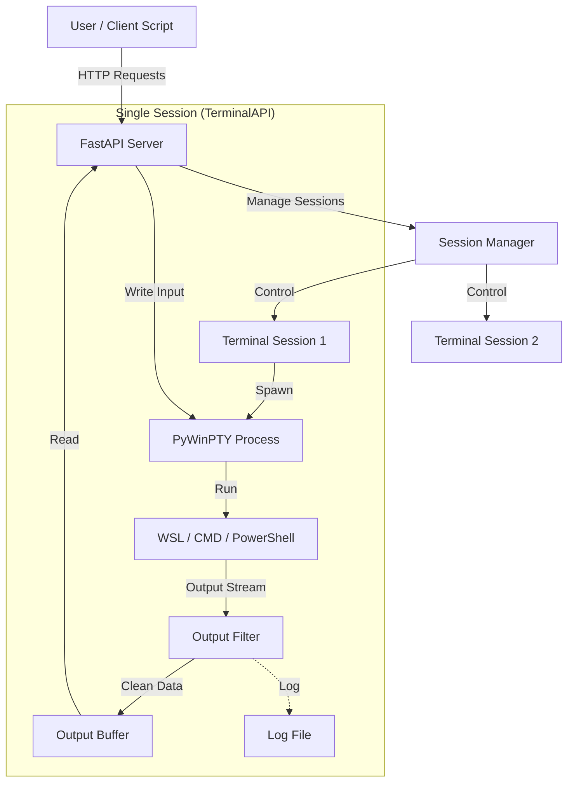

# Pseudo Terminal API

A robust, asynchronous Python API for programmatic terminal interaction on Windows.
This project exposes a **REST API** (FastAPI) that allows you to spawn, control, and interact with real terminal sessions (WSL, PowerShell, CMD) programmatically. It supports interactive applications like **Vim**, **Nano**, and **Python REPLs**, handling ANSI escape sequences and persistent sessions.

## 🚀 Features

*   **Multi-Session Management**: Run multiple independent terminal sessions simultaneously.
*   **Persistent Sessions**: Sessions stay alive between requests (stateful).
*   **Real PTY Support**: Built on `pywinpty` for genuine pseudo-terminal emulation (not just subprocess pipes).
*   **Interactive Input**: Send raw keystrokes (Ctrl+C, arrows, specific chars) to control apps like Vim/Nano.
*   **WSL Integration**: First-class support for **Kali Linux**, Ubuntu, and other WSL distros.
*   **Live Logging**: Automatically streams session output to `logs/` for real-time monitoring.
*   **Command History**: Tracks commands executed in each session.
*   **Clean Output**: Filters "junk" ANSI sequences (Device Attributes, etc.) while preserving formatting.

---

## 🛠️ Architecture

Here is how the components interact to provide a persistent terminal session:



### Component Roles
*   **Client**: Your python script or frontend that sends HTTP requests.
*   **FastAPI Application (`app/server.py`)**: The entry point. Receives HTTP requests and routes them to the Session Manager.
*   **Session Manager (`app/session_manager.py`)**: Holds the state of all active sessions. It creates, retrieves, and kills sessions.
*   **Terminal API (`app/terminal_api.py`)**: The heavy lifter. Each instance wraps a single `pywinpty` process. It handles:
    *   Spawning the real shell (WSL/CMD).
    *   Reading raw output in a background thread.
    *   Cleaning "junk" ANSI codes (like cursor tracking requests) so you get clean text.
    *   Writing your input commands to the shell.

---

## 🛠️ Installation

1.  **Clone the repository:**
    ```bash
    git clone https://github.com/Readyaddy/Psudo-terminal-api.git
    cd Psudo-terminal-api
    ```

2.  **Install Dependencies:**
    ```bash
    pip install -r requirements.txt
    ```
    *(Requires `fastapi`, `uvicorn`, `pywinpty`, `pydantic`)*

3.  **Requirements:**
    *   Windows 10/11
    *   Python 3.8+
    *   (Optional) WSL enabled for Linux support.

## ⚡ Quick Start

1.  **Start the Server:**
    Run the server as a module from the root directory:
    ```bash
    python -m app.server
    ```
    The API will run at `http://127.0.0.1:8000`.

2.  **View Documentation:**
    Open your browser to `http://127.0.0.1:8000/docs` for the interactive Swagger UI.

## 📖 API Usage

### 1. Create a Session
**Endpoint:** `POST /sessions`

Create a new terminal. By default, it launches **Kali Linux** (via WSL).

```json
// Request
{
  "name": "my-kali-session",
  "cols": 120,
  "rows": 30
}
```

*   **Advanced:** To run a different shell, use the `shell_command` or `distro` field:
    *   `"distro": "Ubuntu"` -> Runs `wsl -d Ubuntu`
    *   `"shell_command": "powershell.exe"` -> Runs native PowerShell.

### 2. Execute a Command
**Endpoint:** `POST /sessions/{id}/command`

Use this for standard shell commands where you want to type the command and hit "Enter".

```json
// Request
{
  "command": "ls -la"
}
```
*   **Response:** Returns the immediate output of the command.

### 3. Interactive Input (Raw Mode)
**Endpoint:** `POST /sessions/{id}/input`

Use this for interactive apps (Vim, Nano) or sending special keys. It sends text **exactly** as provided (no automatic "Enter").

```json
// Request (Type 'i' to enter insert mode in Vim)
{
  "command": "i"
}
```

### 4. Read Output
**Endpoint:** `GET /sessions/{id}/output`

Retrieves any unread output from the session buffer. Useful for monitoring long-running tasks.

## 💡 Examples

You can find working examples in the `testing_code/` directory.

### Using Python to Interact
See `testing_code/example_interactive.py` for a full demo.

```python
import requests

# 1. Create Session
sess = requests.post("http://localhost:8000/sessions", json={"name": "demo"}).json()
sid = sess['id']

# 2. Run Python interactively
requests.post(f"http://localhost:8000/sessions/{sid}/command", json={"command": "python"})

# 3. Send Input to the running Python process
requests.post(f"http://localhost:8000/sessions/{sid}/command", json={"command": "print('Hello World')"})
```

### Controlling Vim
See `testing_code/verify_vim.py`. The API allows you to open Vim, send `i` (insert), type text, send `Esc`, and `:wq` to save/quit programmatically.

## ⚙️ Configuration

*   **Default Shell**: Configured in `app/terminal_api.py` (Default: `cmd.exe /c wsl -d kali-linux`).
*   **Connection**: `app/server.py` runs on `127.0.0.1` port `8000`, but you can modify it to `0.0.0.0` for external access.

## 📦 Project Structure

```text
/
├── app/                  # Core application package
│   ├── __init__.py
│   ├── server.py         # FastAPI application entry point
│   ├── session_manager.py # Manages session state & persistence
│   └── terminal_api.py   # Low-level PTY wrapper & output filtering
├── logs/                 # Stores session output logs (auto-generated)
├── testing_code/         # Usage examples & verification scripts
├── requirements.txt      # Python dependencies
└── README.md             # Documentation
```

## 🤝 Contributing

1.  Fork the repository.
2.  Create a feature branch (`git checkout -b feature/amazing-feature`).
3.  Commit your changes.
4.  Push to the branch.
5.  Open a Pull Request.
